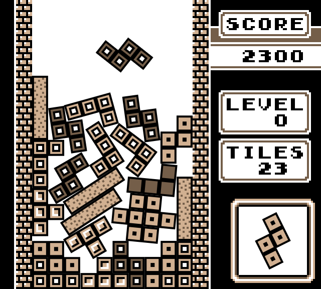

LÖVE（以降 "love2d" とする）は、Lua という動的型付け言語で書くことができるゲームフレームワーク。
Windows、Mac OS X、Linux、Android、iOS 用にゲームを作ることができる。

love2d で制作されたゲームとしては、"NOT TETRIS 2" （Stabyoneself氏） や、 "Strange Telephone" （yuta氏、現在は Unity に移植）、"Color Finder" （hako生活氏）などがある。

API は基礎的なものばかりが用意されており、

